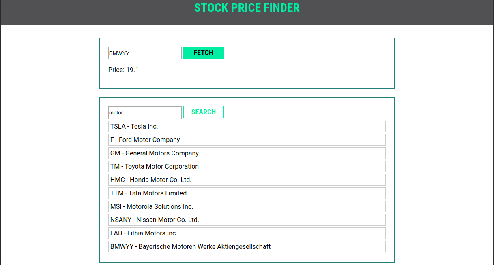

# Stock Price check project

## Description
Idea of this final project is to build a simple application which would be able to search and check real stock prices.

As an idea it could looks like this:

Overview what it capable of:
TODO: is it possible to put video here?

## Spec
What this application should be able to do at the end:

1. Search stock price data via identifier (ex.: ZM, APPL and so on).
2. Search list of awailable stocks via regular search query (ex.: "apple", "zoom", "insurance" and so on).
3. Search results should be displayed and selectable.
4. During search loader should be displayed, to show to user that he/she started process.
5. Possibility to reset the results and start from beginning.
6. More functionality is up to you!

## What is diffcult
Applications itself is not really complex, but there would be interesting places. Some of them:

1. Usage of external api. Ofc teachers can provide placeholder hunctions to work with this api, but you should be able to understand the idea of it.
2. How to make loader be diplayible after user clicked on something and after data arrived?

## External resource
API would be taken from this website: https://www.alphavantage.co/