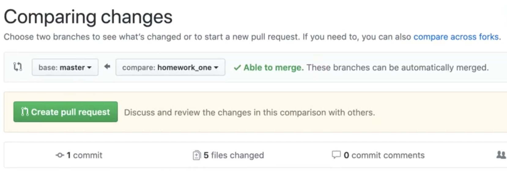
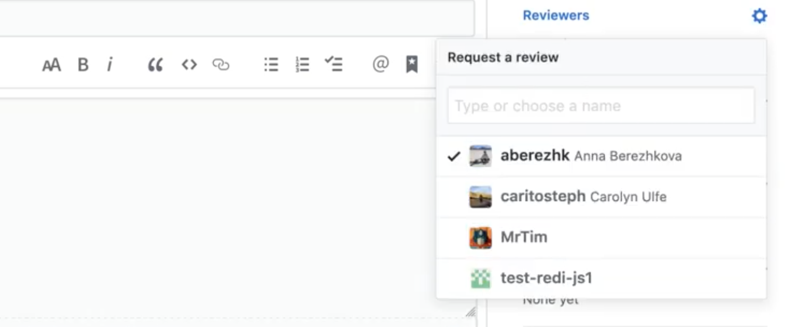

# Homework Workflow

## Steps to submit your homework

1. Check if you are in your master branch.

```
git branch
```

2. Keep your local repository updated.

```
git pull origin master && git fetch
```

3. Create a NEW branch for your homework from master.

```
git checkout -b homework_1
```

4. Do your changes and add to your homework branch.

```
git add .
```

5. Commit your changes in your new branch.

```
git commit -m "Add your own message here"
```

6. Once you done with your assigment push your changes on your new branch.

```
git push --set-upstream origin homework_1
```

7. Create a pull request to merge your new branch into master.



8. Select ALL teachers as reviewers.



9. Reviewers going to add comments (if they find things to improve).

## Steps to update reviewers' comments

1. Check if you are in your homework branch.

```
git branch
```

2. Do your new changes and add to your homework branch.

```
git add .
```

3. Commit your new changes in your homework branch.

```
git commit -m "Add your own message here"
```

4. Once you done with your updates push your changes on your homework branch.

```
git push --set-upstream origin homework_1
```

5. Let reviewers know that you updated the code adding a comment.

6. They are going through and resolve their comments.

7. When you get an approval comment (at least one of the teachers), you can merge your pull request in master.

## **🎉GREAT!! You complete your homework.🎉**
