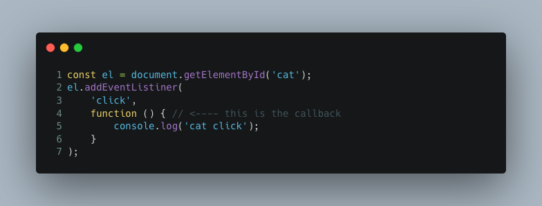

# Calling APIs Lecture

## What is an API?

From wikipedia:

> An application programming interface (API) is a computing interface which defines interactions between multiple software intermediaries.

[https://en.wikipedia.org/wiki/Application_programming_interface](https://en.wikipedia.org/wiki/Application_programming_interface)

In the web development context the term usually used with a more lose definition. More like: 

> remote servers that can be called/messaged

The remote server could do any number of things:

- Logged you in
- Track things like clicks
- Get more content for the user
- Send request on your behalf to another api for example to turn on a light
- Add things to your shopping cart
- Check if a product is in stock
- Send an Email
- ...

## What is async programming?

Most code is synchronous. It is executed line by line until it is done. Sort of like reading a book start to finish. Asynchronous programming as you may have guessed is why code is executed in an out of order fashion. Like reading a book by starting on the 45th page and reading for 5 pages. We need async coding for things like calling an api because the request might take a while and we don't want our code to pause and wait for the response. The user might interact with the page in that time and we need the code to also respond to that. 

In javascript there are three many ways of async programming. Through callbacks,, promises (bit older method) and via async functions (native support in modern browsers). 

Calls backs we won't cover in this lecture because we have done so extensively in pervious classes. Think about:



Going line by line the we can see on line 2 an function is registered as a click callback but it is not executed. This is an example of async programming because the program will continue on past this code and come back to it later.

## Promises

Resource Links:

- [Docs](https://developer.mozilla.org/en-US/docs/Web/JavaScript/Reference/Global_Objects/Promise)
- [freecodecamp tutorial](https://www.freecodecamp.org/learn/javascript-algorithms-and-data-structures/es6/create-a-javascript-promise)

A promise is a special kind of object to help us deal with async code. We can chain thing together with **.then, .catch, and .finally.** We can also use promises to wrap 

setTimeout Example:

```js
function delayedLog(message, delaySec) {
    const delayedPromise =  new Promise(function(resolve, reject) {
        setTimeout(function() {
            if (message.length > 25) {
                return reject("message to long");
            }
            console.log(message);
            return resolve();
        }, delaySec);
    }).then(function() {
        console.log('message sent');
    });
}
```

Promise chain:

```js
delayedLog('Hello world', 3000)
.then(function() {
    return delayedLog('I am a delayed message', 2000);
})
.then(function() {
    return delayedLog('Here is a really long messssssssssssssage', 5000);
})
.catch(function() {
    console.log('oops we have a problem');
})
.finally(function() {
    console.log('sent all messages');
});
```

In this example we create a promise by hand and use it to wrap the async setTimeout call back logic. We are then able to wait for all the message to log and then log "message sent". This is a powerful concept we can use in many ways.

## Promise.all()

- [Docs](https://developer.mozilla.org/en-US/docs/Web/JavaScript/Reference/Global_Objects/Promise/all)

A useful thing to do when working with promises is to run something once all promises have resolved. This can be used to model complex multistep logics.

## Async Await

Resource Links:

- [Docs](https://developer.mozilla.org/en-US/docs/Web/JavaScript/Reference/Statements/async_function)
- [Tutorial](https://javascript.info/async-await)

Async functions are a modern way to work with promises that is closer to normal programming. They avoid a common problem of [callback hell](http://callbackhell.com/) in an elegant way. One you understand promises async is just a bit more on top. They are functions that return promises and can await promises inside. They are sort of like Promise.all() in that the function resolves itself when all await statements inside resolve. In a lot of cases we can avoid using the promise syntax all together and just using async functions. The fetch function for example returns a promise so we can await it very easily. 

Async function with error handling

```js
(async function() {
    try {
        await delayedLog('Hello world', 300)
        await delayedLog('I am a delayed message', 2000);
        await delayedLog('Here is a really long messssssssssssssage', 5000);
    } catch {
        console.log('oops there was a problem');
    }
    console.log('sent all messages');
})();
```

## Fetch!
