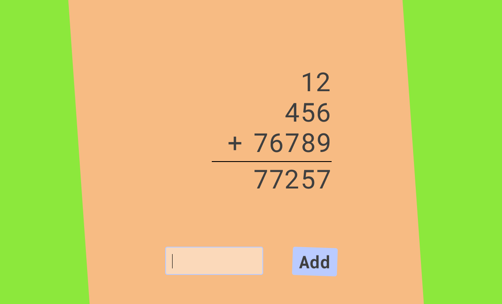
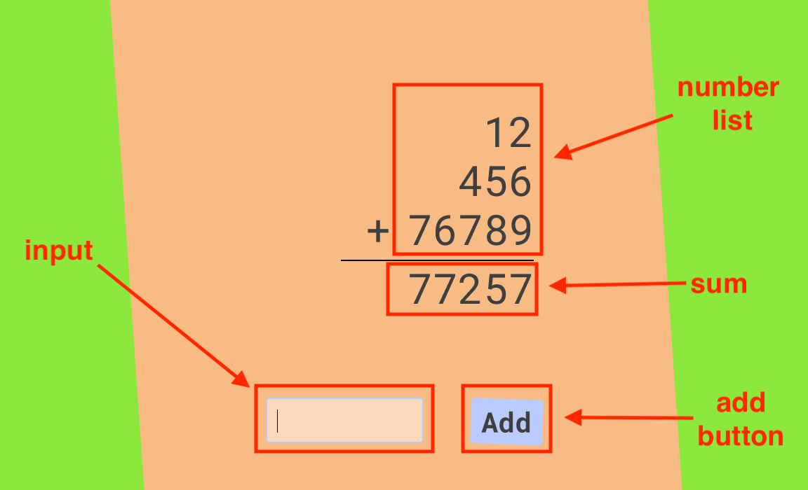

# Lesson 4 Classwork

The goal of todays class work is to make a sort of visual additional calculator using what we have
learned in the first few lectures.

- variables, strings and numbers
- basic functions
- document selectors like `getElementById`
- document events like "change" and "click" via `addEventListener`
- html element creation with `createElement` and `appendChild`

> 
> Styled Demo

## Spec

> 
> Annotated Demo

The app is comprised of four components:

1. numbers list
2. sum
3. add button
4. input

It should work as follows:

- numbers are entered into the input
- upon clicking the add button the current number in the input is added to the numbers list and the
  sum of the numbers is recalculated
- after the number is added the input is cleared

## Tips

- it is possible to create this app without logic operators / control statements. No `if` statements
  needed
- consider keeping state like the sum in a global variable and only writing the sum element not
  reading

## Bonus

Challenge:  
Can you make your addition calculator match the image pixel perfect?
